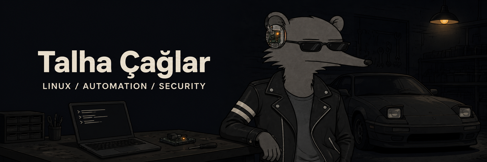

  

  <a href="https://talhacaglar.github.io/">Portfolio</a> &nbsp; / &nbsp;
  <a href="https://www.linkedin.com/in/talhacaglar1/">LinkedIn</a> &nbsp; / &nbsp;
  <a href="mailto:talhacaglarr@proton.me">Email</a> &nbsp; / &nbsp;
  <a href="https://t.me/Cgllar">Telegram</a>

### Under the hood

I build small tools around **Linux, automation and everyday problems** — from terminal apps
to desktop utilities. I enjoy taking systems apart, understanding their behavior, and making
them work better for the way I use them.

Currently exploring **mobile systems and AI/LLM security** through authorized lab work.
Outside the terminal: cars, racing games, and a long-standing curiosity about technology.

### In the garage

<table>
<tr>
<td width="50%" valign="top">
<h3><a href="https://github.com/talhacaglar/Clar-Focus">Clar Focus</a></h3>

Tasks, Pomodoro sessions and focus controls for Arch Linux and Hyprland.

PYTHON / TEXTUAL / SQLITE
</td>
<td width="50%" valign="top">
<h3><a href="https://github.com/talhacaglar/archsweep">archsweep</a></h3>

An opt-in terminal cleaner for Arch-based systems. Small, direct, written in Bash.

BASH / ARCH LINUX
</td>
</tr>
<tr>
<td width="50%" valign="top">
<h3><a href="https://github.com/talhacaglar/PrintHub">PrintHub</a></h3>

Network printer, toner, stock and Active Directory management in one desktop application.

ELECTRON / JAVASCRIPT
</td>
<td width="50%" valign="top">
<h3><a href="https://github.com/talhacaglar/TUI-Anlik-Cevirmen">TUI Anlık Çevirmen</a></h3>

Instant Turkish translation with DeepL, without leaving the terminal.

PYTHON / DEEPL
</td>
</tr>
</table>

Also building [Lexis](https://github.com/talhacaglar/Lexis), a personalized AI-assisted dictionary.
[Browse all projects →](https://github.com/talhacaglar?tab=repositories)

### Daily setup

`Arch Linux` &nbsp; `Hyprland` &nbsp; `Python` &nbsp; `Shell` &nbsp; `TypeScript` &nbsp; `SQLite`

[My dotfiles](https://github.com/talhacaglar/dotfiles) · [Project notes & portfolio](https://talhacaglar.github.io/)
