 

## 🍭 About Me

- 🔐 I spend most of my time learning and building around **cybersecurity**.
- 🐧 I work a lot with **Linux**, terminal tooling, automation, and system-level workflows.
- 🛠️ I like projects that are hands-on, practical, and technically clean.
- 🧪 I enjoy exploring both software development and security-oriented experimentation.

## 🎯 Current Focus

- 🕵️ Learning more deeply about cybersecurity and security-focused development.
- ⚙️ Building practical projects across Linux, automation, and developer tooling.
- 🌊 Exploring system workflows around **Wayland / Hyprland / Waybar**.
- 📈 Improving my engineering skills through real projects rather than isolated demos.

## 🧰 Tech Stack

## 🌟 Featured Projects

| Project | Summary |
| --- | --- |
| [**Lexis**](https://github.com/talhacaglar/Lexis) | AI-supported, modern, and personalized dictionary application. |
| [**printhub**](https://github.com/talhacaglar/printhub) | Network printer management: toner cost, stock, Active Directory and ISO 27001 (Electron). |
| [**Clar Corp Security Lab**](https://github.com/talhacaglar/Clar-Corp-Security-Lab) | Security-oriented experiments, notes, and lab-style development work. |
| [**Clar Focus**](https://github.com/talhacaglar/Clar-Focus) | A Linux-focused productivity and workflow project built around terminal-based usage. |
| [**hyprland-keybinds**](https://github.com/talhacaglar/hyprland-keybinds) | My personal Hyprland keybinding setup and workflow notes. |

## 📊 GitHub Stats

## 🐍 Contribution Snake

<picture>
  <source media="(prefers-color-scheme: dark)" srcset="https://raw.githubusercontent.com/talhacaglar/talhacaglar/output/snake-dark.svg" />
  
</picture>

## 🧭 Principles

- 🧱 Keep learning by building real things.
- ✂️ Prefer practical systems over unnecessary complexity.
- 🔍 Stay curious about security, Linux, and low-level behavior.
- ✨ Make tools understandable, useful, and clean.

## 📬 Find Me Here

