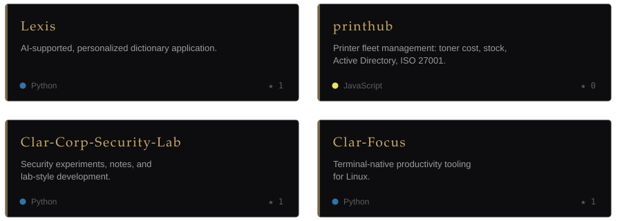
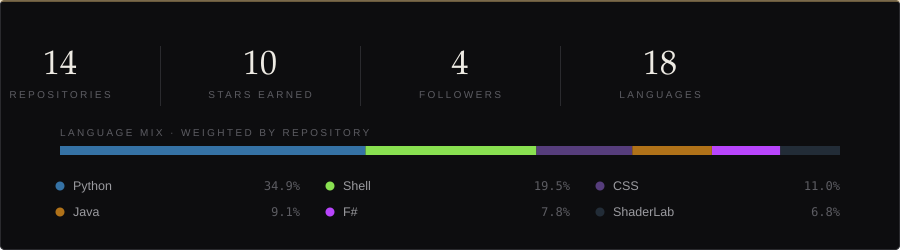

  

I work in the space between security and systems — Linux tooling, automation, 
and software that stays clean under real use.

 

<h3>S E L E C T E D &nbsp; W O R K</h3>

Also: <a href="https://github.com/talhacaglar/hyprland-keybinds">hyprland-keybinds</a> · <a href="https://github.com/talhacaglar/archsweep">archsweep</a> · <a href="https://github.com/talhacaglar/TarlamCebimde">TarlamCebimde</a>

  

<h3>C R A F T</h3>

| | |
| --: | :-- |
| **Languages** | Python · Dart · JavaScript · Java · SQL |
| **Interfaces** | Textual · Flutter · Electron |
| **Systems** | Linux · Arch · Wayland · Hyprland |
| **Data** | SQLite · Firebase |
| **Focus** | Security · Automation · Developer tooling |

 

<h3>R E C O R D</h3>

  

  

<h3>A P P R O A C H</h3>

Learn by building real things. 
Prefer restraint over complexity. 
Stay close to the system.

 

 

<a href="https://github.com/talhacaglar">GitHub</a> &nbsp;·&nbsp;
<a href="https://www.linkedin.com/in/talhacaglar1/">LinkedIn</a> &nbsp;·&nbsp;
<a href="https://t.me/Cgllar">Telegram</a>

