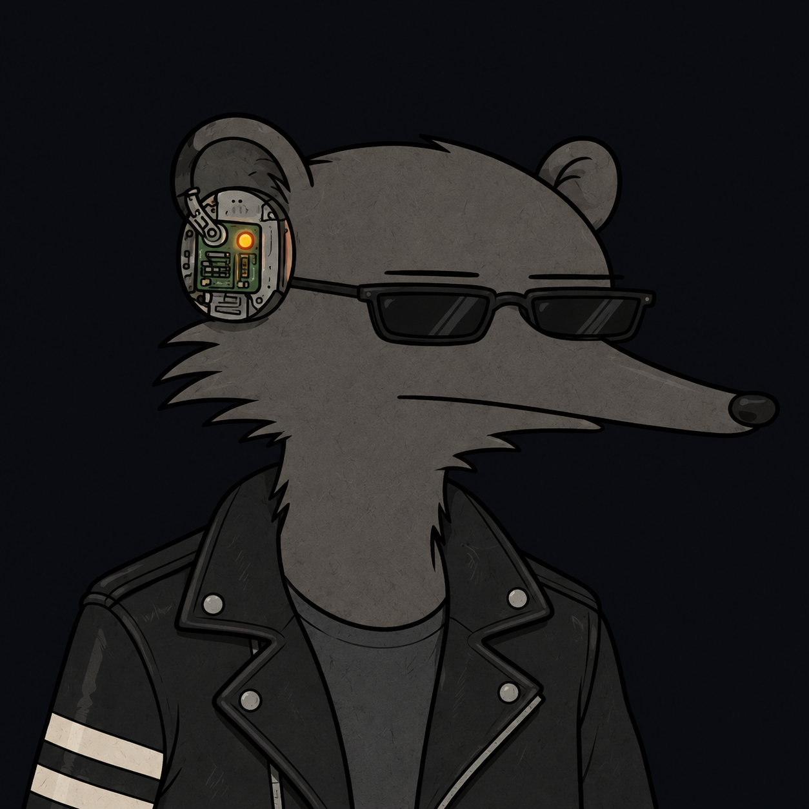

# Talha Çağlar

Linux, automation & security.

I build tools for the way I use my computer: terminal apps, desktop utilities,
and small automations that solve everyday problems.

I like understanding how systems work — and what happens when you take them apart.
Currently exploring mobile systems and AI/LLM security through authorized lab work.

[Portfolio](https://talhacaglar.github.io/) · [LinkedIn](https://www.linkedin.com/in/talhacaglar1/) · [Email](mailto:talhacaglarr@proton.me)

 

---

### Things I've built

- [Clar Focus](https://github.com/talhacaglar/Clar-Focus) — Tasks, focus sessions and a Pomodoro timer for Arch Linux and Hyprland. Python, Textual, SQLite.
- [archsweep](https://github.com/talhacaglar/archsweep) — An opt-in terminal cleaner for Arch-based systems, written in Bash.
- [PrintHub](https://github.com/talhacaglar/PrintHub) — Network printer, toner, stock and Active Directory management. Electron, JavaScript.
- [TUI Anlık Çevirmen](https://github.com/talhacaglar/TUI-Anlik-Cevirmen) — Instant Turkish translation with DeepL, straight from the terminal. Python.
- [Lexis](https://github.com/talhacaglar/Lexis) — A personalized, AI-assisted dictionary application. Python.

### Around the workbench

`Linux` · `Python` · `Shell` · `TypeScript` · `Electron` · `SQLite`

My daily environment is Arch Linux with Hyprland. Away from the terminal,
I'm usually interested in cars, racing games, or another piece of technology to figure out.

[Dotfiles](https://github.com/talhacaglar/dotfiles) · [More projects](https://github.com/talhacaglar?tab=repositories) · [Telegram](https://t.me/Cgllar)
