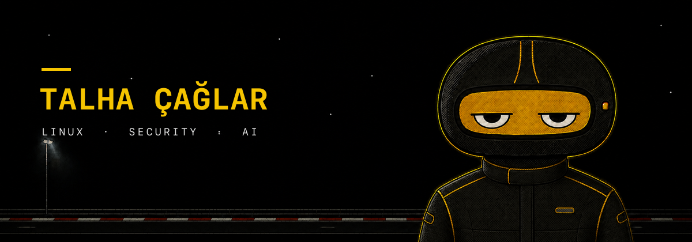

  

  <a href="https://talhacaglar.github.io/">Portfolio</a>
  &nbsp;·&nbsp;
  <a href="https://www.linkedin.com/in/talhacaglar1/">LinkedIn</a>
  &nbsp;·&nbsp;
  <a href="mailto:talhacaglarr@proton.me">Email</a>
  &nbsp;·&nbsp;
  <a href="https://t.me/Cgllar">Telegram</a>

## About

I build practical software around **Linux, automation and security**. Most of my work starts with
a real problem and ends as a focused tool: terminal-first when it makes sense, graphical when it
helps, and always kept as simple as the job allows.

I am currently exploring mobile systems and **AI/LLM security** through hands-on, authorized lab
work.

`Linux` · `Python` · `TypeScript` · `Shell` · `Electron` · `SQLite`

## Selected work

| Project | What it does | Built with |
| :-- | :-- | :-- |
| **[Clar Focus](https://github.com/talhacaglar/Clar-Focus)** | Terminal-first productivity suite for Arch Linux, Hyprland and Omarchy. | Python · Textual · SQLite |
| **[PrintHub](https://github.com/talhacaglar/PrintHub)** | Network printer, toner, stock and Active Directory management. | Electron · JavaScript |
| **[Lexis](https://github.com/talhacaglar/Lexis)** | Personalized, AI-assisted dictionary application. | Python |
| **[TUI Anlık Çevirmen](https://github.com/talhacaglar/TUI-Anlik-Cevirmen)** | Instant Turkish translation with DeepL in a keyboard-first terminal interface. | Python |

## Principles

- Useful before impressive.
- Readable before clever.
- Small surface area, clear behavior.
- Learn by building, testing and taking systems apart.

## Contact

The shortest route is **[email](mailto:talhacaglarr@proton.me)**. You can also find my work and
longer project notes on **[talhacaglar.github.io](https://talhacaglar.github.io/)**.
